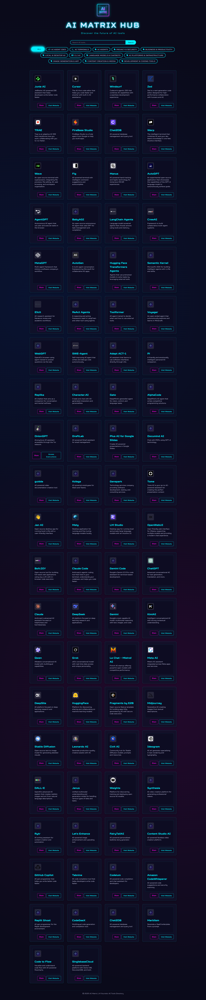

# AI Matrix - Futuristic AI Tools Directory

A modern, cyberpunk-inspired website with a Sci-Fi aesthetic that showcases various AI tools categorized by their functionality. The website allows users to browse, search, and filter AI tools across multiple categories in a visually stunning interface.

<details>
  <summary>AI Matrix Screenshot (click to expand)</summary>
  
</details>

## Features

- **Futuristic Sci-Fi Design**: Dark theme with neon cyan and magenta accents, glowing elements, animations, and a high-tech feel
- **Category Filtering**: Filter tools by their categories (AI Agents, AI Agent IDEs, AI Terminals, etc.)
- **Search Functionality**: Search for tools by name, description, or category
- **Share Tools**: Easily copy tool information to share with others
- **Responsive Layout**: Fully responsive design that works on desktop and mobile devices
- **Dynamic Content**: All tool data is loaded from YAML files for easy maintenance
- **Auto-discovery**: Automatically loads all YAML files from the YAML directory
- **Fallback Mechanism**: Includes hardcoded list of YAML files if directory listing fails
- **Dynamic Copyright Year**: Automatically updates the copyright year
- **Special Case Handling**: Custom handling for specific tools like OnionGPT

## Implementation Details

### File Structure

- `index.html` - Main HTML structure with responsive layout
- `styles.css` - Futuristic Sci-Fi styling with animations and glowing effects
- `script.js` - JavaScript for loading, filtering, searching, and displaying tools
- `YAML/*.yaml` - YAML files containing categorized tool data
- `icons/` - Directory containing tool icons (SVG, PNG, WebP formats)
- `fonts/` - Directory containing the Squares font family for the cyberpunk typography
- `oniongpt.html` - Special instructions page for OnionGPT

### Technologies Used

- HTML5 (Semantic markup)
- CSS3 (Animations, transitions, custom properties, flexbox, grid)
- JavaScript (ES6+, async/await, DOM manipulation)
- [js-yaml](https://github.com/nodeca/js-yaml) - For parsing YAML files
- [Font Awesome](https://fontawesome.com/) - For category and UI icons

### Data Structure

The website loads tool data from multiple YAML files, each representing a category. Each YAML file follows this general structure:

```yaml
categoryName: Category Name
tools:
  - id: 1
    name: Tool Name
    description: Tool description
    websiteUrl: https://example.com
    iconUrl: icons/tool-icon.png
```

The JavaScript code handles variations in the data structure across different files. For example, the ID field might be named differently in different files (e.g., `aiAgentID`, `toolID`), but the normalization function in `script.js` ensures consistent data structure for all tools.

## How to Use

1. Clone the repository
2. Open `index.html` in a web browser
3. Browse all tools or filter by category using the buttons at the top
4. Use the search bar to find specific tools by name, description, or category
5. Click the "Share" button on any tool card to copy its information to your clipboard
6. Click the "Visit Website" button to open the tool's website in a new tab

## User Interaction Features

- **Category Filtering**: Click on category buttons to filter tools by category
- **Search**: Type in the search bar and press Enter or click the Search button
- **Sharing**: Click the Share button on any tool card to copy information to clipboard
- **Responsive Design**: The layout automatically adjusts for different screen sizes
- **Hover Effects**: Tool cards have interactive hover effects with glowing borders
- **Loading Animation**: A futuristic scanning animation displays while tools are loading

## Adding New Tools

To add a new tool:

1. Identify the appropriate category YAML file in the `YAML/` directory
2. Add a new entry to the `tools` array with the required fields:
   - `id`: A unique identifier (can be named according to category, e.g., `aiAgentID`)
   - `name`: The name of the tool
   - `description`: A brief description
   - `websiteUrl`: URL to the tool's website
   - `iconUrl`: Path to the tool's icon (preferably in the `icons/` directory)
3. Add the tool's icon to the `icons/` directory (SVG, PNG, or WebP format recommended)
4. If no icon is available, the default icon will be used automatically

## Creating a New Category

To create a new category:

1. Create a new YAML file named after the category (e.g., `new_category.yaml`) in the `YAML/` directory
2. Follow the structure of existing YAML files
3. Add tools to the new category
4. The website will automatically detect and display the new category
5. Add an appropriate icon mapping in the `getCategoryIcon` function in `script.js` for the new category

## Browser Compatibility

The website is compatible with modern browsers:
- Brave (latest)
- Chrome (latest)
- Firefox (latest)
- Safari (latest)
- Edge (latest)

The site uses modern CSS features like custom properties, flexbox, and grid layouts, which are supported by all major browsers.

## Performance Considerations

- **Image Optimization**: Tool icons are kept small and optimized for web
- **Lazy Loading**: Images are loaded only when needed
- **Error Handling**: Fallback mechanisms for failed YAML loading and missing icons
- **Responsive Design**: Optimized for both desktop and mobile devices
- **Minimal Dependencies**: Only essential external libraries are used (js-yaml and Font Awesome)

## License

This project is open source and available under the [MIT License](LICENSE).

## Contributing

Contributions are welcome! Feel free to submit a pull request to add new tools, categories, or improve the website's functionality.

## Acknowledgments

- Font Awesome for the category icons
- The Squares font family for the cyberpunk typography
- All the amazing AI tools featured in this directory
